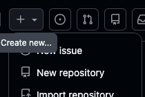
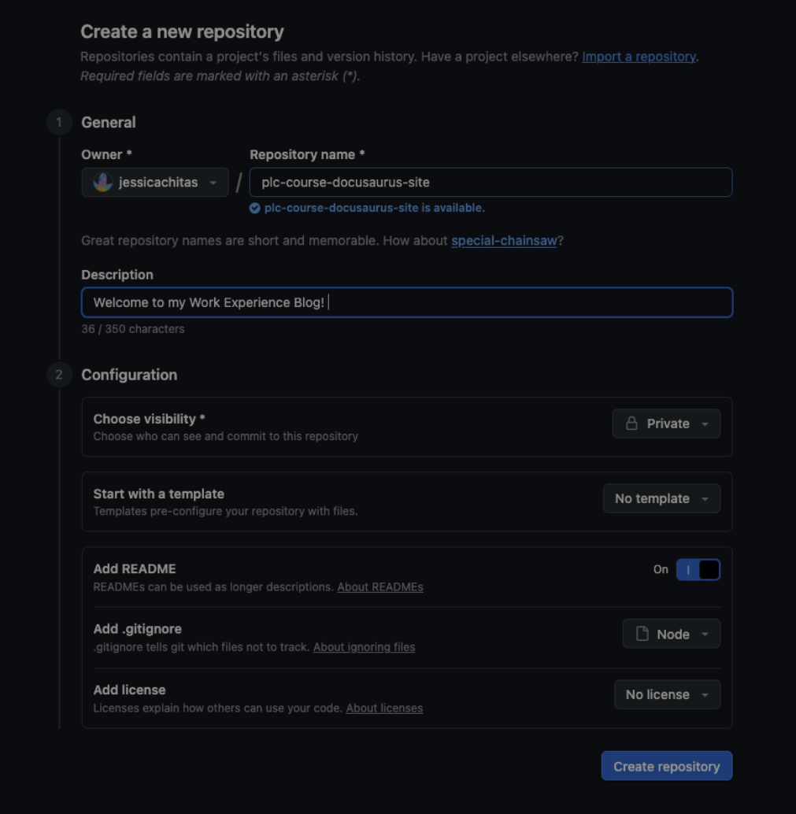
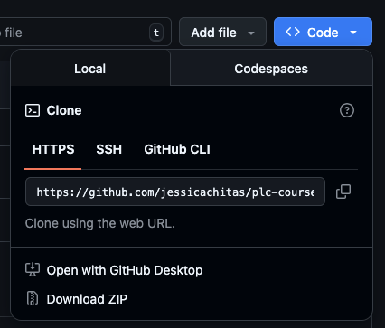

In this workshop, you'll learn how to create your own Docusaurus blog from scratch. We'll cover everything from installing the necessary tools to deploying your site on GitHub Pages.

<!-- truncate -->

## Prerequisites

Before we begin, make sure you have:
- A computer running Windows, macOS, or Linux
- An internet connection
- A GitHub account (create one at [github.com](https://github.com) if you don't have one)

---

## Step 1: Install Node.js

Node.js is a JavaScript runtime that Docusaurus requires to run. There are two ways to install it:

### Option A: Direct Download (Recommended for beginners)

1. Go to [https://nodejs.org/en](https://nodejs.org/en)
2. Click the **Download** button
3. Run the installer and follow the installation wizard

### Option B: Using NVM (Node Version Manager)

NVM allows you to install and manage multiple Node.js versions. This is useful for developers who work on multiple projects.

```bash
# Download and install nvm:
curl -o- https://raw.githubusercontent.com/nvm-sh/nvm/v0.40.3/install.sh | bash

# In lieu of restarting the shell
\. "$HOME/.nvm/nvm.sh"

# Download and install Node.js:
nvm install 24

# Verify the Node.js version:
node -v # Should print "v24.13.1".

# Verify npm version:
npm -v # Should print "11.8.0".
```

:::tip
After installation, close and reopen your terminal to ensure the changes take effect.
:::

---

## Step 2: Install Git

Git is a version control system that we'll use to manage our code and deploy to GitHub.

### Linux (Fedora/RHEL)

```bash
dnf install git
```

### macOS

```bash
# Using Homebrew
brew install git
```

### Windows

Download and install from [https://git-scm.com/downloads](https://git-scm.com/downloads)

### Verify Installation

```bash
git --version
# Output: git version x.x.x
```

---

## Step 3: Set Up GitHub Repository

### Create a New Repository

1. Log into [GitHub](https://github.com)
2. Click the **+** button in the top right corner and select **New repository**



3. Configure your repository with these settings:

| Setting | Value |
|---------|-------|
| **Owner** | Your username |
| **Repository name** | `YOUR-REPO-NAME` |
| **Visibility** | Public |
| **Add .gitignore** | Node |



4. Click **Create repository**

---

## Step 4: Clone the Repository

After creating your repository, you need to clone it to your local machine.

1. On your repository page, click the green **Code** button
2. Copy the HTTPS URL (it should look like `https://github.com/YOUR-USERNAME/YOUR-REPO-NAME.git`)



3. Open your terminal and run:

```bash
git clone https://github.com/YOUR-USERNAME/YOUR-REPO-NAME.git
```

4. Navigate into the cloned directory:

```bash
cd YOUR-REPO-NAME
```

---

## Step 5: Set Up Docusaurus

### Open in Visual Studio Code

1. Open Visual Studio Code
2. Go to **File** → **Open Folder** and select your cloned repository
3. Open a new terminal in VS Code: **Terminal** → **New Terminal**

### Install Docusaurus

Run the following command to create a new Docusaurus site:

```bash
npx create-docusaurus@latest my-docusaurus-site classic
```

When prompted:
- Press **Y** and **Enter** to proceed with the installation
- Choose **JavaScript** when asked about the language

:::info
This will create a new folder called `my-docusaurus-website` containing your Docusaurus site.
:::

---

## Step 6: Create a Sample Blog Post  

Navigate to the blog directory and create a new blog post:

```bash
cd my-docusaurus-website/blog
```

Create a new file with today's date in the filename (e.g., `2026-02-18-my-first-post.md`):

```markdown
---
slug: my-first-post
title: My First Blog Post
authors: [your-name]
tags: [introduction, hello]
---

Welcome to my first blog post! This is where I'll share my learning journey.

<!-- truncate -->

## What I'm Learning

I'm excited to start documenting my progress in this course. Stay tuned for more updates!
```

### Understanding the Frontmatter

The section between the `---` markers at the top of the file is called **frontmatter**. It contains metadata about your blog post in YAML format. Here's what each field means:

| Field | Description |
|-------|-------------|
| `slug` | The URL path for your blog post. For example, `slug: my-first-post` makes the post accessible at `/blog/my-first-post`. If omitted, Docusaurus uses the filename. |
| `title` | The title of your blog post that appears at the top of the page and in the blog listing. This is also used for SEO and browser tabs. |
| `authors` | A list of author IDs (defined in `authors.yml`) or inline author objects. Use square brackets for multiple authors: `[author1, author2]`. |
| `tags` | Categories for your post that help readers find related content. Tags create filterable links on your blog. Use square brackets: `[tag1, tag2]`. |

### FYI: Additional Frontmatter Options 

You can also use these optional fields:

| Field | Description |
|-------|-------------|
| `date` | Override the post date (format: `YYYY-MM-DD` or full ISO date). By default, the date is extracted from the filename. |
| `description` | A short description for SEO meta tags and blog post previews. If omitted, Docusaurus uses the first line of content. |
| `image` | The cover/thumbnail image URL for social media cards and blog listing. |
| `hide_table_of_contents` | Set to `true` to hide the table of contents sidebar. |
| `draft` | Set to `true` to exclude the post from production builds (only visible in development). |
| `keywords` | An array of keywords for SEO purposes: `[keyword1, keyword2]`. |

### The Truncate Marker

The `<!-- truncate -->` comment is special—it tells Docusaurus where to cut off the preview in the blog listing. Everything above this marker appears as the summary on the blog index page, while the full content is shown on the individual post page.

---

## Step 7: Configure Your Website

Open `my-docusaurus-website/docusaurus.config.js` and update the configuration:

```javascript
const config = {
  title: 'My Learning Diary',
  tagline: 'Documenting my programming journey',
  favicon: 'img/favicon.ico',

  // Set the production url of your site here
  url: 'https://YOUR-USERNAME.github.io',
  // Set the /<baseUrl>/ pathname under which your site is served
  baseUrl: '/YOUR-REPO-NAME/',

  // GitHub pages deployment config
  organizationName: 'YOUR-USERNAME', // Your GitHub username
  projectName: 'YOUR-REPO-NAME', // Your repo name

  // ... rest of the config
};
```

### Understanding the Configuration

Here's what each configuration option does:

| Field | Description |
|-------|-------------|
| `title` | The name of your website. Appears in the browser tab, header, and is used for SEO. |
| `tagline` | A short description/slogan for your site. Often displayed on the homepage below the title. |
| `favicon` | Path to the small icon that appears in browser tabs. Located in the `static/img/` folder. |
| `url` | The full URL where your site will be hosted. For GitHub Pages, this is `https://USERNAME.github.io`. |
| `baseUrl` | The path after the domain where your site lives. For project repos, this is `/<repo-name>/`. Use `/` if deploying to a custom domain or user site. |
| `organizationName` | Your GitHub username or organization name. Used by Docusaurus deployment commands. |
| `projectName` | The name of your GitHub repository. Must match exactly for deployment to work. |

### How URL and Base URL Work Together

Your final site URL is constructed by combining `url` + `baseUrl`:

```
https://YOUR-USERNAME.github.io + /YOUR-REPO-NAME/
= https://YOUR-USERNAME.github.io/YOUR-REPO-NAME/
```

:::tip
If you're deploying to a **user/organization site** (repo named `USERNAME.github.io`), set `baseUrl: '/'` instead.
:::

:::warning
Make sure to replace `YOUR-USERNAME` AND `YOUR-REPO-NAME` with your actual GitHub username and repo name!
:::

---

## Step 8: Set Up GitHub Actions for Deployment

Create the deployment workflow file:

```bash
mkdir -p .github/workflows
```

Create a new file `.github/workflows/deploy.yml` with the following content:

```yaml
name: Deploy to GitHub Pages

on:
  push:
    branches:
      - main

permissions:
  contents: read
  pages: write
  id-token: write

jobs:
  build:
    runs-on: ubuntu-latest
    steps:
      - uses: actions/checkout@v4
      
      - uses: actions/setup-node@v4
        with:
          node-version: 20
          cache: npm
          cache-dependency-path: my-docusaurus-website/package-lock.json
      
      - name: Install dependencies
        run: npm ci
        working-directory: my-docusaurus-website
      
      - name: Build website
        run: npm run build
        working-directory: my-docusaurus-website
      
      - name: Upload artifact
        uses: actions/upload-pages-artifact@v3
        with:
          path: my-docusaurus-website/build

  deploy:
    environment:
      name: github-pages
      url: ${{ steps.deployment.outputs.page_url }}
    runs-on: ubuntu-latest
    needs: build
    steps:
      - name: Deploy to GitHub Pages
        id: deployment
        uses: actions/deploy-pages@v4
```

---

## Step 9: Push to GitHub

Now it's time to push all your changes to GitHub!

```bash
# Go back to the root of your repository
cd ..

# Add all files to staging
git add .

# Commit your changes
git commit -m "Initial Docusaurus setup"

# Push to GitHub
git push origin main
```

---

## Step 10: Watch GitHub Actions Deploy Your Site

1. Go to your repository on GitHub
2. Click on the **Actions** tab
3. You should see a workflow running called "Deploy to GitHub Pages"
4. Wait for the workflow to complete (it should show a green checkmark ✓)
5. Once deployed, your site will be available at:
   ```
   https://YOUR-USERNAME.github.io/YOUR-REPO-NAME/
   ```

---

## Troubleshooting

### Common Issues

| Problem | Solution |
|---------|----------|
| `npm: command not found` | Restart your terminal or reinstall Node.js |
| `git: command not found` | Make sure Git is installed and in your PATH |
| Build fails on GitHub Actions | Check that your `baseUrl` matches your repository name |
| Page shows 404 | Enable GitHub Pages in repository Settings → Pages |

---

## Next Steps

Now that your Docusaurus site is up and running, you can:

- ✏️ Add more blog posts to document your learning
- 🎨 Customize the theme and styling
- 📚 Add documentation pages for your projects
- 🔌 Explore Docusaurus plugins for additional functionality

Happy blogging! 🚀
